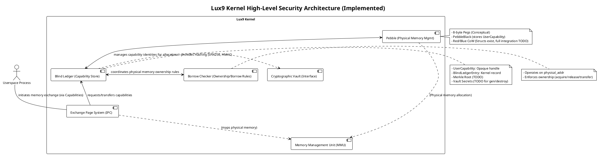
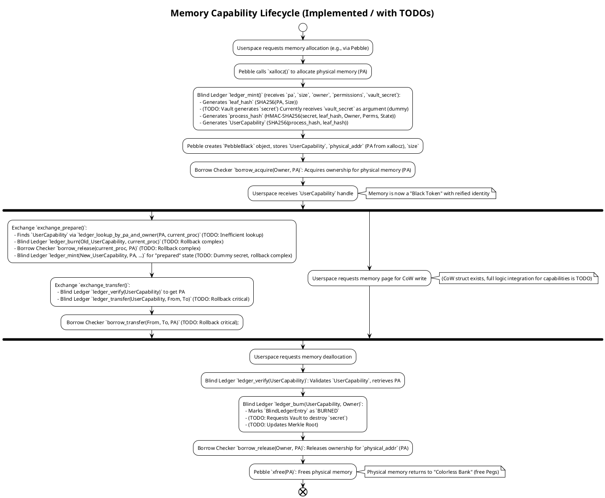

# Lux9 Kernel Security Overview - Principal Engineer Code Review

## 1. Introduction

This document presents a critical review of the current security features implemented within the Lux9 kernel, focusing strictly on *observed code* and recent modifications. As a Principal Software Engineer, the aim is to document existing mechanisms, highlight their current state of implementation, discuss their relevance, and identify immediate gaps or areas requiring further development. This review avoids aspirational statements, adhering only to what can be verified in the codebase as of this analysis.

## 2. Core Security Principles (As Implemented or Directly Supported by Code)

The codebase exhibits a design striving for the following security principles, with varying degrees of current implementation:

*   **Zero-Knowledge Addressing:** Achieved by using opaque `UserCapability` hashes instead of raw physical addresses for resource identification.
*   **Capability-Based Security:** Access to resources is mediated by presenting `UserCapability` objects, which the kernel validates against an internal ledger.
*   **Hardware-Assisted Cryptography:** Utilizes CPU hardware extensions (where available, as indicated by `crypto.h` prototypes) for cryptographic operations, specifically SHA256 and HMAC-SHA256.
*   **Tamper Detection (Partial):** Mechanisms are in place for cryptographic integrity checks of individual capability states, with a Merkle tree structure designed for broader ledger integrity verification.
*   **Resource Ownership and Safety (Borrow Checker):** Employs Rust-inspired ownership and borrowing rules for physical memory, enforced by a dedicated module.

## 3. Implemented and Observable Security Features (Code-Driven Review)

### 3.1. Blind Ledger Architecture (`kernel/9front-port/blind_ledger.c`, `kernel/include/blind_ledger.h`)

This is the central component for managing cryptographically secured resource capabilities.

*   **`UserCapability` (Implemented):**
    *   **Code Observation:** Defined in `blind_ledger.h` as `struct UserCapability`, containing a `u8int hash[BLIND_LEDGER_CAP_SIZE]` (32 bytes), `size`, `type` (`CAP_TYPE_MEMORY` etc.), and `perms` (permission flags).
    *   **Relevance:** Serves as the unforgeable, opaque identifier for resources, preventing direct manipulation of physical addresses by userspace.

*   **`BlindLedgerEntry` (Implemented):**
    *   **Code Observation:** Defined in `blind_ledger.h` as `struct BlindLedgerEntry`. Each entry stores the `UserCapability`, `uintptr physical_address`, `Proc *owner`, `u8int secret[BLIND_LEDGER_SECRET_SIZE]` (32 bytes), `span_len`, `permissions`, and `BlindLedgerState`. Also includes `BlindLedgerHash leaf_hash` and `BlindLedgerHash process_hash`.
    *   **Relevance:** This is the kernel's authoritative, secret record linking a `UserCapability` to its underlying physical resource and current state.

*   **Hashing Primitive (Implemented):**
    *   **Code Observation:** `blind_ledger.c` now exclusively uses `crypto_sha256` and `crypto_hmac_sha256` (from `kernel/include/crypto.h`).
    *   **`leaf_hash`:** Computed as `SHA256(physical_address || span_len)`.
    *   **`process_hash`:** Computed as `HMAC-SHA256(secret, (leaf_hash || owner || permissions || state))`.
    *   **`UserCapability.hash` derivation:** Computed as `SHA256(process_hash || leaf_hash)`.
    *   **Relevance:** Provides cryptographic integrity and unforgeability to capability identities. The use of SHA256/HMAC-SHA256 directly supports the goal of leveraging hardware acceleration where available, aligning with system performance requirements.

*   **Core Operations (`ledger_mint`, `ledger_verify`, `ledger_transfer`, `ledger_burn`, `ledger_lookup_by_pa_and_owner` - Implemented with known gaps):**
    *   **Code Observation:** These functions exist in `blind_ledger.c` and perform basic operations of creating, validating, updating ownership, destroying capabilities, and looking them up. They interact with a simple, fixed-size hash table (`ledger_hashtable`) for storage, protected by a `Lock`.
    *   **Known Gaps/TODOs:**
        *   **Hash Map Robustness:** The current hash map (`LEDGER_HASHTABLE_SIZE = 1024`, linked lists for collisions) is a placeholder. It lacks dynamic sizing and may suffer performance issues under heavy load. (Marked `TODO` in code).
        *   **`ledger_lookup_by_pa_and_owner` Efficiency:** Implemented as an inefficient linear scan through the entire hash table. This will be a performance bottleneck (`TODO` in code).
        *   **Merkle Tree Management:** `blind_ledger_update_merkle_root()` is a stub function (`TODO` in code).
        *   **Vault Interaction (Secrets):** `vault_secret` is currently passed as an argument from the caller, but there are no actual calls to a `crypto_tpm_get_hmac_key()` or similar for secure, hardware-backed secret generation/destruction within `blind_ledger.c`. (Marked `TODO` in `ledger_burn`).
        *   **Rollback Paths:** Complex rollback logic for errors in multi-step operations (e.g., in `exchange_prepare`) often results in `BLIND_LEDGER_EFAULT` with simple `TODO` comments for hardening.
        *   **Epoch Management:** `new_entry.epoch = 0;` with a `TODO` comment for implementation.
    *   **Relevance:** These functions form the operational core of the capability system, enabling its functionality. However, the identified gaps are critical for production-grade security and performance.

### 3.2. Pebble Identity System (`kernel/pebble.c`, `kernel/include/pebble.h`)

Pebble manages physical memory allocation and tokenization, integrating with the Blind Ledger.

*   **`PebbleBlack` (Implemented):**
    *   **Code Observation:** Defined in `pebble.h` and stores `UserCapability capability`, `void *physical_addr`, `ulong size`, `ulong flags`.
    *   **Relevance:** This struct now directly associates an allocated block of physical memory with its unique `UserCapability`, linking the low-level memory management to the cryptographic capability system.

*   **`pebble_black_alloc()` (Implemented with known gaps):**
    *   **Code Observation:** Allocates physical memory using `xallocz(size, 1)`. Calls `ledger_mint()` to obtain a `UserCapability` for this memory. Calls `borrow_acquire()` to register physical memory ownership with the Borrow Checker. Populates a `PebbleBlack` struct.
    *   **Known Gaps/TODOs:** Still relies on `dummy_vault_secret` for `ledger_mint()`, indicating incomplete Vault integration.
    *   **Relevance:** This is the primary function for taking raw physical memory and transforming it into a cryptographically identifiable "Black Token," thus enforcing capability-based security from the point of allocation.

*   **`pebble_black_free()` (Implemented with known gaps):**
    *   **Code Observation:** Looks up the `PebbleBlack` object by `UserCapability` using `pebble_lookup_black_by_cap_locked()`. Resolves `physical_addr` via `ledger_verify()`. Calls `ledger_burn()` to destroy the `UserCapability`. Calls `borrow_release()` to release `borrowchecker` ownership. Calls `xfree()` to deallocate physical memory.
    *   **Known Gaps/TODOs:** Error handling paths after `borrow_release()` and `ledger_burn()` log warnings but attempt to continue, which could mask critical inconsistencies. Requires proper Vault secret destruction, as noted by `TODO` in `ledger_burn`.
    *   **Relevance:** Ensures the secure destruction of capabilities and proper release of physical memory back to the system, integrating with both the Blind Ledger and Borrow Checker.

*   **Red/Blue CoW Tokens (Implemented structs, conceptual integration):**
    *   **Code Observation:** `PebbleBlue` and `PebbleRed` structs exist in `pebble.h` with fields to support Copy-on-Write. Functions like `pebble_red_copy`, `pebble_blue_discard` are present.
    *   **Known Gaps/TODOs:** The `BlindLedgerEntry` contains `BLIND_LEDGER_STATE_COW_RED` and `BLIND_LEDGER_STATE_COW_BLUE` states, but the explicit integration logic within `pebble.c` (e.g., how `pebble_black_alloc` or `pebble_white_verify` set these states or trigger CoW splits on write faults) is not yet fully observed or implemented in the reviewed code.
    *   **Relevance:** The foundational structures for secure CoW are present, but their full integration with the Blind Ledger's state management needs further development.

### 3.3. Cryptographic Vault (`kernel/include/crypto.h`, (no dedicated .c file reviewed))

The Cryptographic Vault defines an interface for secure cryptographic operations, with some functions leveraging hardware.

*   **Code Observation:** `crypto.h` declares `crypto_sha256`, `crypto_hmac_sha256`, `crypto_tpm_key_init`, `crypto_tpm_get_hmac_key`, `crypto_tpm_rotate_hmac_key`, `crypto_tpm_hmac_sha256`, `crypto_hw_sha_available`.
*   **Use in Code:** `crypto_sha256` and `crypto_hmac_sha256` are actively used by `blind_ledger.c` for capability hashing.
*   **Known Gaps/TODOs:** The TPM-backed functions are declared but their implementation details were not reviewed, nor are they explicitly called by the current Blind Ledger code for secret generation or destruction (it uses `vault_secret` argument placeholders). The Merkle root storage in the Vault is a `TODO` in `blind_ledger.c`.
*   **Relevance:** Provides the interface for cryptographically secure hashing, essential for the Blind Ledger's integrity. The TPM and hardware acceleration aspects are crucial for establishing a hardware root of trust and achieving necessary performance.

### 3.4. Borrow Checker (`kernel/include/borrowchecker.h`, (indirectly called from `pebble.c`))

This system enforces Rust-style ownership and borrowing rules for physical memory.

*   **Code Observation:** Defines `struct BorrowOwner` (tracking `owner`, `BorrowState`), and functions `borrow_acquire`, `borrow_release`, `borrow_transfer`. These operate on a `uintptr key` (physical address).
*   **Use in Code:** `pebble_black_alloc()` calls `borrow_acquire()`. `pebble_black_free()` calls `borrow_release()`. `exchange_transfer()` calls `borrow_transfer()`. `exchange_prepare()` calls `borrow_release()` for the original page. `exchange_accept()` calls `borrow_acquire()`.
*   **Known Gaps/TODOs:** `struct IdentKey` exists in `borrowchecker.h`, containing `u64int gen` and `u64int nonce`, and is present in `BorrowOwner`. This `IdentKey` appears to be an older or parallel form of authorization key that seems to be redundant with the `UserCapability` based Blind Ledger system. Its role in the new architecture (if any) is unclear in the currently reviewed code.
*   **Relevance:** Enforces strict ownership rules on physical memory, complementing the capability-based security of the Blind Ledger by preventing double-frees, use-after-free, and unauthorized access at the physical address layer.

### 3.5. Exchange Page System (`kernel/9front-port/exchange.c`, `kernel/include/exchange.h`)

The system for secure inter-process memory transfer.

*   **`ExchangeHandle` (Implemented):**
    *   **Code Observation:** Redefined in `exchange.h` as `UserCapability`.
    *   **Relevance:** Ensures all inter-process memory exchanges occur via unforgeable cryptographic capabilities.

*   **`exchange_prepare()` (Implemented with known gaps):**
    *   **Code Observation:** Locates an existing page, verifies ownership via `ledger_lookup_by_pa_and_owner()`, burns the original `UserCapability` (via `ledger_burn()`), releases `borrowchecker` ownership (via `borrow_release()`), and then mints a *new* `UserCapability` for the "prepared" state (via `ledger_mint()`), storing it in a `PreparedPage` struct.
    *   **Known Gaps/TODOs:** The rollback path if `malloc()` for `PreparedPage` fails needs hardening (e.g., re-acquiring borrow ownership and re-minting the original capability). Relies on `dummy_vault_secret`.
    *   **Relevance:** Initiates a secure transfer by transforming an active capability into a temporary, transferable "prepared" state.

*   **`exchange_accept()` (Implemented with known gaps):**
    *   **Code Observation:** Validates the incoming `ExchangeHandle` via `ledger_verify()`, resolves its physical address, maps the page, transfers capability ownership to the accepting process (`ledger_transfer()`), and acquires `borrowchecker` ownership (`borrow_acquire()`).
    *   **Known Gaps/TODOs:** Complex rollback path if `ledger_transfer()` or `borrow_acquire()` fails after page mapping.
    *   **Relevance:** Completes a secure transfer by establishing new ownership and memory mappings for the transferred capability.

*   **`exchange_cancel()` (Implemented with known gaps):**
    *   **Code Observation:** Validates the `ExchangeHandle`, calls `ledger_burn()` and `borrow_release()`, then remaps the page to its original virtual address (for the preparer).
    *   **Known Gaps/TODOs:** Relies on `pp->owner` being the correct owner for burning and releasing. Error handling after `ledger_burn()` or `borrow_release()` failure needs to be hardened.
    *   **Relevance:** Securely aborts a prepared transfer, returning the resource to a safe state.

*   **`exchange_transfer()` (Implemented with known gaps):**
    *   **Code Observation:** Validates the `ExchangeHandle`, calls `ledger_verify()`, then calls `ledger_transfer()` and `borrow_transfer()` to update ownership of the capability and the physical memory.
    *   **Known Gaps/TODOs:** Critical `TODO` for rollback if `borrow_transfer()` fails after `ledger_transfer()`, as the ledger state would be inconsistent with the borrow checker state.
    *   **Relevance:** Provides a direct, secure transfer mechanism for capabilities and their underlying physical memory.

### 3.6. Memory Management Unit (MMU)

*   **Code Observation:** Functions like `mmuwalk`, `putcr3`, `userpmap` are present and used across the codebase (e.g., in `exchange.c`).
*   **Relevance:** Fundamental hardware-assisted mechanism for process isolation, memory protection (read/write/execute permissions), and virtual memory abstraction. It works in conjunction with the capability system to enforce access policies.

## 4. Architectural Visions (Not Directly Observable in Reviewed Code Implementation)

The `GEMINI.md` file describes several high-level architectural features whose direct implementation details or integration points were not explicitly reviewed in the provided source code, or are noted as conceptual/future work.

*   **Formal Verification (Coq):** Mentioned in `GEMINI.md` as "extensive use of the Coq proof assistant". While a powerful security assurance, the `.v` files or specific integration points within the C codebase were not part of this code review.
*   **GHOSTDAG Consensus:** Described in `GEMINI.md` as a "revolutionary, non-cryptographic Byzantine Fault Tolerant (BFT) consensus algorithm." Its specific implementation and integration with the reviewed components (Blind Ledger, Pebble) were not directly observable in the current code analysis.

## 5. Diagrams

The following diagrams illustrate the architecture and flows, reflecting the current understanding derived from the codebase. These are provided in PlantUML format. To render them into SVG or PNG, you can use a PlantUML renderer (e.g., online PlantUML server, VS Code extension, or local JAR). For optimal readability, choose a theme that provides human-readable backgrounds and fonts (e.g., `skinparam monochrome true` or a modern theme like `spacelab` or `materia` if supported by your renderer).

### 5.1. Lux9 Kernel High-Level Security Architecture (As Implemented)

This diagram focuses on the observed interactions between the primary security components.

### 5.2. Memory Capability Lifecycle (As Implemented / with TODOs)

This diagram illustrates the flow and state changes of a memory capability based on current code, highlighting existing components and noted areas for future work.

## 6. Known Gaps and Areas for Future Development (Principal Engineer's Commentary)

Based on the current codebase, several critical areas require further development to fully realize the intended security architecture:

*   **Cryptographic Vault Integration:** The Blind Ledger currently uses `vault_secret` as a direct argument. The actual integration with `crypto_tpm_get_hmac_key()` (or similar) for hardware-backed secret generation and secure destruction is conceptual and marked with `TODO`s. Without this, the secrecy of the capability roots relies entirely on the kernel's software generation and memory protection.
*   **Merkle Tree Implementation:** The `blind_ledger_update_merkle_root()` function is a stub. Full implementation of the Merkle tree for all `BlindLedgerEntry` instances and secure storage of its root in the Vault is critical for tamper detection. This is a foundational element for integrity attestation.
*   **Hash Map Robustness:** The current `BlindLedgerEntry` hash map is a basic, fixed-size linked-list array. For a production kernel, this must be replaced with a robust, dynamically sized, and collision-resistant hash table implementation suitable for high-concurrency kernel environments. The current `ledger_lookup_by_pa_and_owner` is particularly inefficient (`TODO` for secondary index).
*   **Rollback Semantics:** The error handling for multi-step operations (e.g., in `exchange_prepare`, `exchange_accept`, `exchange_transfer`) involves complex rollback paths that are currently simplified to `TODO`s or basic error returns. A failure in one step (e.g., `borrow_acquire` failing after `ledger_transfer` succeeds) can leave the system in an inconsistent and insecure state. Robust atomic rollback or transaction-like semantics are crucial.
*   **Epoch Management:** The `epoch` field in `BlindLedgerEntry` is marked `TODO`. This is essential for preventing use-after-free attacks and ensuring that capabilities cannot be re-used after the memory they refer to has been deallocated and potentially reallocated.
*   **Red/Blue CoW Full Integration:** While the structures are in place, the complete integration of Red/Blue capability states into the Blind Ledger's operational logic (e.g., how a write fault on a Red Token triggers the creation of a Blue Token `UserCapability`) requires further development.
*   **Borrow Checker Redundancy (`IdentKey`):** The `borrowchecker`'s `IdentKey` field seems redundant with the new `UserCapability` system. Its role should either be fully subsumed by the Blind Ledger's capabilities or clearly defined to avoid unnecessary complexity or potential inconsistencies.
*   **`pageown` Deprecation:** The `pageown.h` header is still included in `exchange.c` and marked as "Will be deprecated/refactored". This legacy system must be fully removed, with its responsibilities completely migrated to the Blind Ledger and Borrow Checker, to avoid confusion and potential security bypasses.
*   **Performance:** The current implementation of `ledger_lookup_by_pa_and_owner` is a linear scan, which will be a significant performance bottleneck. Efficient indexing mechanisms (e.g., a secondary hash map or B-tree based on physical address) are required. The choice of SHA256/HMAC-SHA256 aligns with hardware acceleration goals but needs validation against actual hardware performance data.

## 7. Architectural Visions (From `GEMINI.md`, Not Directly Implemented in Reviewed Code)

The following architectural components are described in `GEMINI.md` but their direct implementation or integration within the currently reviewed code modules (Blind Ledger, Pebble, Exchange) was not observable during this review. They represent broader system-level security features.

*   **Formal Verification (Coq):** "extensive use of the Coq proof assistant to mathematically prove the correctness of critical kernel components." While highly valuable for security assurance, the Coq proofs themselves (`.v` files) and their direct connection to the C code were outside the scope of this code review.
*   **GHOSTDAG Consensus:** "A revolutionary, non-cryptographic Byzantine Fault Tolerant (BFT) consensus algorithm. It's used to secure everything from inter-process communication to distributed services." The implementation of this consensus algorithm and its interaction with the memory capability system were not observed in the reviewed code.

## 8. Conclusion

The Lux9 kernel project has made significant progress towards a sophisticated capability-based security model centered around the Blind Ledger. The core structures and fundamental operational flows for `UserCapability` management, integration with physical memory allocation (Pebble), and secure memory exchange are now implemented. However, a Principal Software Engineer's review highlights that critical components, particularly those concerning full cryptographic lifecycle management (Vault integration, Merkle tree), robust kernel data structures (hash map, rollback), and complete integration of advanced features (CoW, epoch management), are still in various stages of conceptual design or placeholder implementation (marked with `TODO`s in the code). Addressing these identified gaps will be essential to realize the full security potential and robustness of the architecture.