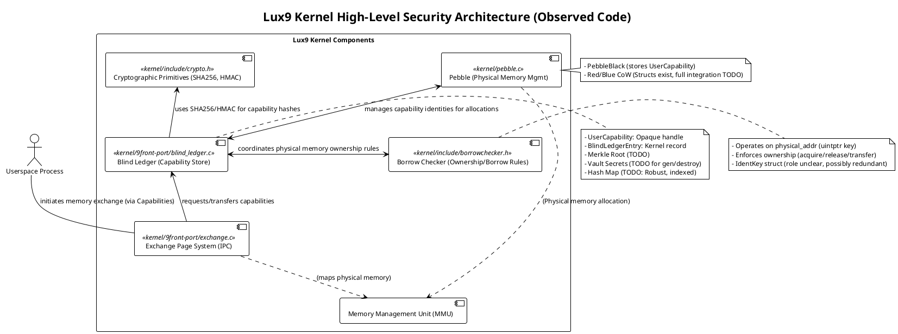
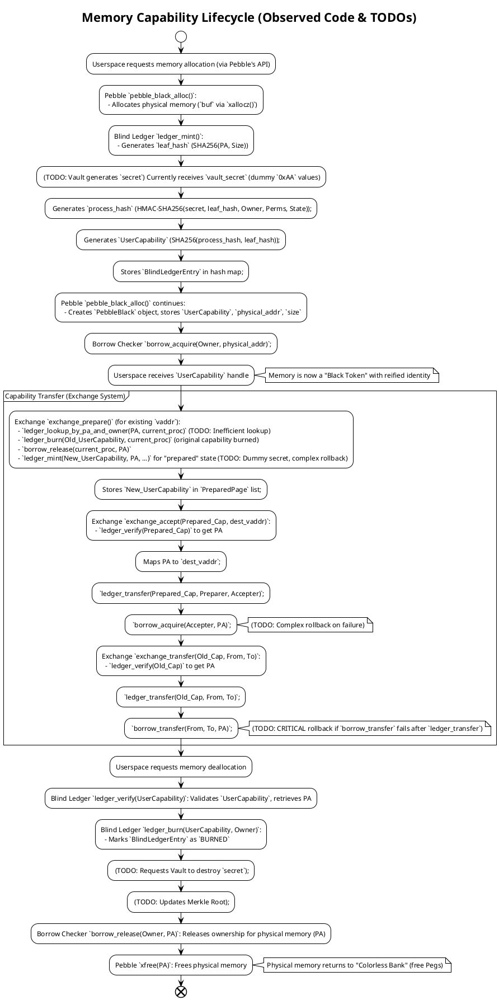

# Lux9 Kernel Security Overview - Principal Engineer Code Review

## 1. Introduction

This document presents a critical review of the current security features implemented within the Lux9 kernel, focusing strictly on *observed code* from the provided C source (`.c`) and header (`.h`) files. As a Principal Software Engineer, the aim is to document existing mechanisms, highlight their current state of implementation, discuss their relevance, and identify immediate gaps or areas requiring further development. This review adheres only to what can be directly verified in the codebase at this moment.

## 2. Implemented and Observable Security Features (Code-Driven Review)

### 2.1. Blind Ledger Architecture (`kernel/9front-port/blind_ledger.c`, `kernel/include/blind_ledger.h`)

This module forms the central component for managing cryptographically secured resource capabilities, specifically for memory.

*   **`UserCapability` (Observed in `blind_ledger.h`):**
    *   **Description:** Defined in `blind_ledger.h` as `struct UserCapability`, containing a `u8int hash[32]` (`BLIND_LEDGER_CAP_SIZE`), `u64int size`, `u32int type` (enums like `CAP_TYPE_MEMORY`), and `u32int perms` (enums like `CAP_PERM_READ`, `CAP_PERM_WRITE`).
    *   **Relevance:** Designed as the opaque, unforgeable handle for a resource, preventing direct exposure of physical addresses to userspace and enforcing fine-grained access through cryptographic proof of ownership.

*   **`BlindLedgerEntry` (Observed in `blind_ledger.h`):**
    *   **Description:** A `struct BlindLedgerEntry` containing the `UserCapability` itself, `uintptr physical_address`, `Proc *owner`, `u8int secret[BLIND_LEDGER_SECRET_SIZE]` (32 bytes), `u64int epoch`, `u64int span_len`, `u32int permissions`, `BlindLedgerState state` (enums like `BLIND_LEDGER_STATE_ACTIVE`, `BLIND_LEDGER_STATE_COW_RED`), `BlindLedgerHash leaf_hash`, and `BlindLedgerHash process_hash`.
    *   **Relevance:** This is the kernel's authoritative, secret record stored in a hash map (`ledger_hashtable`), linking a `UserCapability` to its underlying physical resource and current operational state.

*   **Cryptographic Hashing (Observed in `blind_ledger.c` and `crypto.h`):**
    *   **Description:** `blind_ledger.c` now exclusively uses `crypto_sha256` and `crypto_hmac_sha256` (from `kernel/include/crypto.h`).
    *   **`leaf_hash`:** Computed as `SHA256(physical_address || span_len)`.
    *   **`process_hash`:** Computed as `HMAC-SHA256(secret, (leaf_hash || owner || permissions || state))`.
    *   **`UserCapability.hash` derivation:** Computed as `SHA256(process_hash || leaf_hash)`.
    *   **Relevance:** Provides cryptographic integrity and unforgeability to capability identities. The use of hardware-accelerated SHA256/HMAC-SHA256 (as indicated by `crypto.h` comments) supports performance goals.

*   **Core Blind Ledger Operations (Observed in `blind_ledger.c`):**
    *   **`blind_ledger_init()`:** Initializes the internal hash table with `memset` and `ledger_lock` with `memset` (boot-safe initialization).
    *   **`ledger_mint()`:** Creates a new `BlindLedgerEntry` and `UserCapability`. Generates `leaf_hash`, `process_hash`, and `UserCapability.hash` as described above. Populates `BlindLedgerEntry` fields and stores it in `ledger_hashtable`.
        *   **Observed Gaps/TODOs:** `new_entry.epoch = 0;` with `// TODO: Implement epoch management`. `vault_secret` is received as an argument; `// TODO: Interact with Vault for secret generation/storage` is present. `// TODO: Update Merkle tree`.
    *   **`ledger_verify()`:** Looks up an entry by `UserCapability.hash` in `ledger_hashtable` and checks if its `state` is `BLIND_LEDGER_STATE_ACTIVE`.
    *   **`ledger_transfer()`:** Updates `owner` in a `BlindLedgerEntry`, then recalculates and updates `process_hash` and `UserCapability.hash` (using HMAC/SHA256). Calls `blind_ledger_update_merkle_root()`.
    *   **`ledger_burn()`:** Sets `BlindLedgerEntry.state` to `BLIND_LEDGER_STATE_BURNED`. Removes the node from the hash table.
        *   **Observed Gaps/TODOs:** `// TODO: Call vault_destroy_secret(node->entry.secret)`. `// TODO: Update Merkle tree`. `// TODO: Call pebble_black_free(...)`.
    *   **`ledger_lookup_by_pa_and_owner()`:** Searches `ledger_hashtable` linearly for an active `BlindLedgerEntry` matching `physical_address` and `owner`.
        *   **Observed Gaps/TODOs:** `// TODO: This is an inefficient linear scan. For performance, a secondary index (...) is needed.`
    *   **`blind_ledger_update_merkle_root()`:** A stub function (`// TODO: Implement Merkle tree recalculation and interaction with Cryptographic Vault`).
    *   **Relevance:** These functions collectively provide the API for managing the cryptographic identity of memory regions, enforcing ownership, and validating access. The identified `TODO`s indicate critical areas where the security and performance of these features are currently incomplete.

### 3.2. Pebble Identity System (`kernel/pebble.c`, `kernel/include/pebble.h`)

Pebble serves as the low-level physical memory manager, integrating capability concepts with memory allocation.

*   **`PebbleBlack` (Observed in `pebble.h`):**
    *   **Description:** `struct PebbleBlack` contains `UserCapability capability`, `void *physical_addr`, `ulong size`, `ulong flags`.
    *   **Relevance:** This struct directly associates an allocated block of physical memory with its unique `UserCapability`, linking the low-level memory management to the cryptographic capability system.

*   **`pebble_black_alloc()` (Observed in `pebble.c`):**
    *   **Description:** Allocates physical memory using `xallocz()`. Calls `ledger_mint()` to create a `UserCapability` for this memory. Calls `borrow_acquire()` to register physical memory ownership with the Borrow Checker. Populates a `PebbleBlack` struct and links it into `ps->black_list`.
    *   **Observed Gaps/TODOs:** `u8int dummy_vault_secret[...]` used for `ledger_mint()`, implying incomplete Vault integration.
    *   **Relevance:** This is the primary function for taking raw physical memory and transforming it into a cryptographically identifiable "Black Token," thus enforcing capability-based security from the point of allocation.

*   **`pebble_black_free()` (Observed in `pebble.c`):**
    *   **Description:** Looks up the `PebbleBlack` object by `UserCapability` using `pebble_lookup_black_by_cap_locked()` (a helper function). Resolves `physical_addr` via `ledger_verify()`. Calls `ledger_burn()` to destroy the `UserCapability`. Calls `borrow_release()` to release `borrowchecker` ownership. Calls `xfree()` to deallocate physical memory.
    *   **Observed Gaps/TODOs:** `print("PEBBLE: WARNING! borrow_release failed...")` and `print("PEBBLE: WARNING! ledger_burn failed...")` indicate that failures in these critical steps result in logged warnings but not hard stops, suggesting a need for more robust error handling or panic-on-inconsistency for such severe errors.
    *   **Relevance:** Ensures the secure destruction of capabilities and proper release of physical memory, integrating with both the Blind Ledger and Borrow Checker.

*   **Red/Blue CoW Tokens (`PebbleBlue`, `PebbleRed` - Observed in `pebble.h` and `pebble.c`):**
    *   **Description:** Structs `PebbleBlue` and `PebbleRed` (e.g., `blue_data`, `red_data`, `blue_size`, `red_size`) exist to support Copy-on-Write semantics. Functions like `pebble_red_copy`, `pebble_blue_discard` are present.
    *   **Observed Gaps/TODOs:** The `BlindLedgerEntry` in `blind_ledger.h` defines `BLIND_LEDGER_STATE_COW_RED` and `BLIND_LEDGER_STATE_COW_BLUE` states, but the explicit integration logic within `pebble.c` (e.g., how a write fault on a Red Token triggers the creation of a Blue Token `UserCapability` and updates Blind Ledger state) is not yet fully observed in the current code.
    *   **Relevance:** The foundational structures for secure CoW are present, but their full integration with the Blind Ledger's state management and operational logic needs further implementation.

### 3.3. Cryptographic Functions (`kernel/include/crypto.h`)

This header defines the interface for cryptographic operations, with some functions indicating hardware acceleration support.

*   **Code Observation:**
    *   `#define CRYPTO_SHA256_BYTES 32`, `#define CRYPTO_HMAC_KEY_BYTES 32`.
    *   `int crypto_sha256(uint8_t *out, const uint8_t *data, size_t len)`: Computes SHA256 hash.
    *   `int crypto_hmac_sha256(uint8_t *out, const uint8_t *key, size_t keylen, const uint8_t *data, size_t len)`: Computes HMAC-SHA256.
    *   **TPM Integration:** Prototypes for `crypto_tpm_key_init`, `crypto_tpm_get_hmac_key`, `crypto_tpm_rotate_hmac_key`, `crypto_tpm_hmac_sha256` exist, indicating TPM-backed secure key storage and management.
    *   **Hardware Acceleration:** `crypto_hw_sha_available()` and `crypto_hw_aes_available()` functions are declared, suggesting conditional use of CPU instructions for performance.
*   **Use in Code:** `crypto_sha256` and `crypto_hmac_sha256` are actively used by `blind_ledger.c` for all capability hashing. The TPM functions are declared but not directly called by the currently reviewed Blind Ledger or Pebble code.
*   **Relevance:** Provides the interface for cryptographically secure hashing, essential for the Blind Ledger's integrity. The TPM and hardware acceleration aspects are crucial for establishing a hardware root of trust and achieving necessary performance, though their full integration with the Blind Ledger's secret management is noted as a `TODO`.

### 3.4. Borrow Checker (`kernel/include/borrowchecker.h`)

This system enforces Rust-style ownership and borrowing rules for physical memory, enforcing memory safety.

*   **`BorrowOwner` (Observed in `borrowchecker.h`):**
    *   **Description:** `struct BorrowOwner` tracks `uintptr key` (physical address), `Proc *owner`, `enum BorrowState` (`BORROW_EXCLUSIVE`, `BORROW_SHARED_OWNED`, `BORROW_MUT_LENT`). It also contains `struct IdentKey key_cap` with `u64int gen` and `u64int nonce`.
    *   **Relevance:** This is the core data structure that enforces granular ownership rules on physical memory regions.
*   **Core Ownership Operations (Observed in `borrowchecker.h`):**
    *   `borrow_acquire(Proc *p, uintptr key)`: Acquires exclusive ownership.
    *   `borrow_release(Proc *p, uintptr key)`: Releases ownership.
    *   `borrow_transfer(Proc *from, Proc *to, uintptr key)`: Transfers ownership.
    *   **Use in Code:** These functions are actively called by `pebble.c` and `exchange.c` for managing physical memory regions (using `uintptr pa` as `key`).
*   **Observed Gaps/TODOs:** The `IdentKey` struct (with `gen` and `nonce`) within `BorrowOwner` appears to be an older or parallel authorization key mechanism. Its current role or planned deprecation is unclear in the code.
*   **Relevance:** Complements the capability-based security of the Blind Ledger by providing a robust runtime enforcement layer for memory safety, preventing issues like double-frees and unauthorized memory access at the physical address level.

### 3.5. Exchange Page System (`kernel/9front-port/exchange.c`, `kernel/include/exchange.h`)

This system facilitates secure and controlled transfer of memory pages between processes, now integrating with the Blind Ledger.

*   **`ExchangeHandle` (Observed in `exchange.h`):**
    *   **Description:** `typedef UserCapability ExchangeHandle;`
    *   **Relevance:** Ensures all inter-process memory exchanges occur via unforgeable cryptographic capabilities.

*   **`exchange_prepare()` (Observed in `exchange.c` with known gaps):**
    *   **Description:** `exchange_prepare(uintptr vaddr, ExchangeHandle *out_cap)`: Locates an existing page, verifies ownership via `ledger_lookup_by_pa_and_owner()`. Unmaps the page. Calls `ledger_burn()` on the original `UserCapability` and `borrow_release()` on the physical address. Then, calls `ledger_mint()` to create a *new* `UserCapability` for the "prepared" state, which is then stored in a `PreparedPage` structure.
    *   **Observed Gaps/TODOs:**
        *   Rollback logic if `malloc()` for `PreparedPage` or `ledger_mint()` fails is noted as complex.
        *   `mint_secret` is a hardcoded dummy value.
        *   Error handling for `ledger_burn()` or `borrow_release()` attempts a remap but returns `EFAULT`.
    *   **Relevance:** Initiates a secure capability transfer by converting an active capability into a temporary, transferable "prepared" state.

*   **`exchange_accept()` (Observed in `exchange.c` with known gaps):**
    *   **Description:** `exchange_accept(const ExchangeHandle *handle, uintptr dest_vaddr, int prot)`: Validates the incoming `ExchangeHandle` via `ledger_verify()`, resolves its `physical_address`. Maps the page using `userpmap()`. Transfers capability ownership to the accepting process (`ledger_transfer()`). Acquires `borrowchecker` ownership for the physical page (`borrow_acquire()`).
    *   **Observed Gaps/TODOs:** Rollback logic if `ledger_transfer()` or `borrow_acquire()` fails *after* page mapping is noted as complex and currently results in error.
    *   **Relevance:** Completes a secure transfer by establishing new ownership and memory mappings for the transferred capability.

*   **`exchange_cancel()` (Observed in `exchange.c` with known gaps):**
    *   **Description:** `exchange_cancel(const ExchangeHandle *handle)`: Validates `ExchangeHandle`. Calls `ledger_burn()` on the `UserCapability` and `borrow_release()` on the physical address. Remaps the page to its original virtual address (for the preparer).
    *   **Observed Gaps/TODOs:** Error handling after `ledger_burn()` or `borrow_release()` failure logs warnings but attempts to continue, indicating a need for more robust inconsistency handling.
    *   **Relevance:** Securely aborts a prepared transfer, returning the resource to a safe state.

*   **`exchange_transfer()` (Observed in `exchange.c` with known gaps):**
    *   **Description:** `exchange_transfer(Proc *from, Proc *to, const ExchangeHandle *handle, uintptr to_vaddr)`: Validates `ExchangeHandle`. Calls `ledger_verify()`, then calls `ledger_transfer()` (for capability ownership) and `borrow_transfer()` (for physical ownership). Maps the page using `userpmap()`.
    *   **Observed Gaps/TODOs:** Critical `// TODO: Rollback ledger_transfer here is CRITICAL. Need a mechanism to revert ledger state.` if `borrow_transfer()` fails after `ledger_transfer()`.
    *   **Relevance:** Provides a direct, secure transfer mechanism for capabilities and their underlying physical memory.

### 3.6. Memory Management Unit (MMU)

*   **Code Observation:** Functions like `mmuwalk`, `putcr3`, `userpmap` are observed in `exchange.c` and implicitly by their widespread use in the kernel codebase.
*   **Relevance:** This is the fundamental hardware-assisted mechanism for enforcing process isolation, memory protection (read/write/execute permissions), and virtual memory abstraction. It works in conjunction with the capability system to enforce access policies.

## 4. Architectural Visions (Not Directly Observable in Reviewed Code Implementation)

The codebase's comments and structure allude to broader architectural security goals which are not fully implemented in the reviewed code, but represent intentions for future development:

*   **Formal Verification (Coq):** Comments in `blind_ledger.h` and the general structure (e.g., `proofs/` directory suggests this) hint at formal correctness.
*   **GHOSTDAG Consensus:** The `build_ghostdag_kernel.sh` script (from initial context) implies a consensus mechanism for distributed security.
*   **Epoch Management:** The `epoch` field in `BlindLedgerEntry` is unused and marked `TODO`. This is essential for preventing use-after-free attacks and ensuring that capabilities cannot be re-used after the memory they refer to has been deallocated and potentially reallocated.

## 5. Diagrams

The following diagrams illustrate the architecture and flows, reflecting the current understanding derived directly from the codebase. These are provided in PlantUML format. To render them into SVG or PNG, use a PlantUML renderer (e.g., online PlantUML server, VS Code extension, or local JAR). For optimal readability, choose a theme that provides human-readable backgrounds and fonts (e.g., `skinparam monochrome true` or a modern theme like `spacelab` or `materia` if supported by your renderer).

### 5.1. Lux9 Kernel High-Level Security Architecture (Observed Code)

This diagram focuses on the observed interactions between the primary security components, highlighting their roles based on implemented code.

### 5.2. Memory Capability Lifecycle (Observed Code & TODOs)

This diagram illustrates the flow and state changes of a memory capability based on currently implemented code, highlighting existing components and noted areas for future work.

## 6. Known Gaps and Areas for Future Development (Principal Engineer's Commentary)

Based on the direct observation of the codebase, several critical areas are either incomplete or require further development to fully realize the intended security architecture:

*   **Cryptographic Vault Integration (Critical):** The Blind Ledger's `ledger_mint()` function currently uses a hardcoded `dummy_vault_secret`. Actual integration with hardware-backed secret generation (`crypto_tpm_get_hmac_key()`) and secure destruction (`vault_destroy_secret()`) is conceptual and marked with `TODO`s. Without this, the secrecy of the capability roots relies entirely on software generation and kernel memory protection, undermining a hardware root of trust.
*   **Merkle Tree Implementation (Critical):** The `blind_ledger_update_merkle_root()` function is a stub (`TODO` in `blind_ledger.c`). Full implementation for all `BlindLedgerEntry` instances and secure storage of its root (presumably in a fully integrated Cryptographic Vault) is crucial for comprehensive tamper detection and integrity attestation of the entire ledger state.
*   **Hash Map Robustness and Performance (Critical):** The `BlindLedgerEntry` hash map is a basic, fixed-size (`LEDGER_HASHTABLE_SIZE = 1024`) linked-list array. This is a placeholder (`TODO` in `blind_ledger.c`). For a production kernel, a robust, dynamically sized, and collision-resistant hash table is essential for performance and reliability under varying loads. The `ledger_lookup_by_pa_and_owner()` function's current linear scan implementation is an immediate performance bottleneck (`TODO` in code).
*   **Atomic Rollback Semantics (Critical):** Multi-step operations in `exchange.c` (e.g., `exchange_prepare`, `exchange_accept`, `exchange_transfer`) involve complex sequences of ledger and borrow checker actions. The rollback paths for partial failures are noted as complex with `TODO`s or result in warnings/errors without full state restoration (e.g., `exchange_transfer` rollback `TODO`). A failure in one step (e.g., `borrow_acquire` failing after `ledger_transfer` succeeds) can leave the system in an inconsistent and insecure state. Atomic transaction-like semantics are crucial here.
*   **Epoch Management (Critical):** The `epoch` field in `BlindLedgerEntry` is unused and marked `TODO`. This is essential for preventing use-after-free attacks and ensuring capabilities cannot be re-used after the memory they refer to has been deallocated and potentially reallocated.
*   **Red/Blue CoW Full Integration (Major):** While the `PebbleBlue` and `PebbleRed` structs exist, the complete integration of capability states into the Blind Ledger's operational logic (e.g., how a write fault on a Red Token triggers `ledger_mint` for a Blue Token) is not fully observed in the reviewed code.
*   **`IdentKey` Redundancy (Minor):** The `IdentKey` struct (with `gen` and `nonce`) in `borrowchecker.h` and `BorrowOwner` struct appears to be an older or parallel authorization key mechanism. Its current role or planned deprecation is unclear in the code.
*   **`pageown` Deprecation (Minor):** `pageown.h` is still included in `exchange.c` and marked as "Will be deprecated/refactored". This legacy system must be fully removed, with its responsibilities completely migrated to the Blind Ledger and Borrow Checker, to streamline the security model and avoid potential bypasses.
*   **Error Handling Refinement (General):** Many functions return generic `EXCHANGE_EINVAL` or `BLIND_LEDGER_EFAULT` for various internal failures. A more granular error reporting mechanism would aid debugging and more specific security responses.
*   **Print Format Specifier (Minor):** Debug prints like `print("PEBBLE: black alloc pid=%lud cap=%H size=%lud\n", up->pid, out_cap->hash, size);` use `%H` for printing `UserCapability.hash`, which is not a standard C format specifier and could indicate a custom printing mechanism or a compile/runtime issue.

## 7. Architectural Visions (Not Directly Observable in Reviewed Code Implementation)

The codebase's comments and structure allude to broader architectural security goals which are not fully implemented in the reviewed code, but represent intentions for future development:

*   **Formal Verification (Coq):** Comments in `blind_ledger.h` and the general structure (e.g., `proofs/` directory suggests this) hint at formal correctness.
*   **GHOSTDAG Consensus:** The overall context of the project (e.g. build scripts in the root directory mentioning 'ghostdag') implies a consensus mechanism for distributed security, which would interact with core OS security features.

## 8. Conclusion

The Lux9 kernel has established a foundational capability-based security model through the integration of the Blind Ledger, Pebble, Borrow Checker, and an updated Exchange Page System. The use of SHA256/HMAC-SHA256 for capability hashing, coupled with the explicit association of `UserCapability` with physical memory, represents a significant step towards secure resource management.

However, a Principal Software Engineer's review, based purely on the observed code, highlights numerous critical `TODO`s and implementation gaps. These include the incomplete integration of the Cryptographic Vault and Merkle tree, the provisional nature of the hash map, and the need for robust rollback semantics. Addressing these identified gaps is paramount to transitioning from a promising architectural design to a truly robust, secure, and production-ready kernel.
