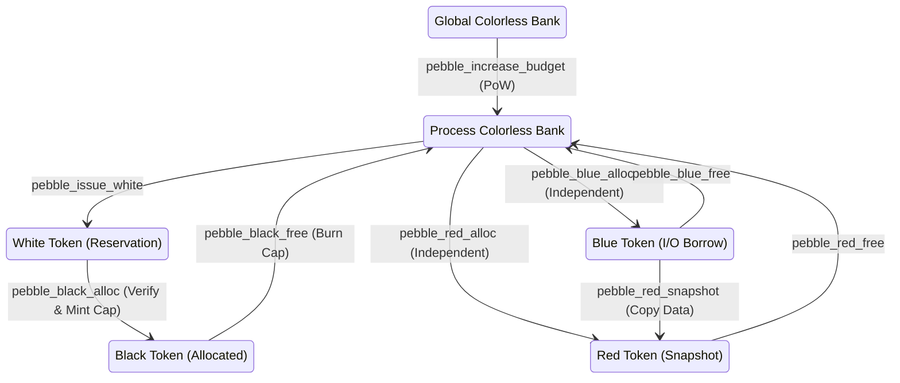
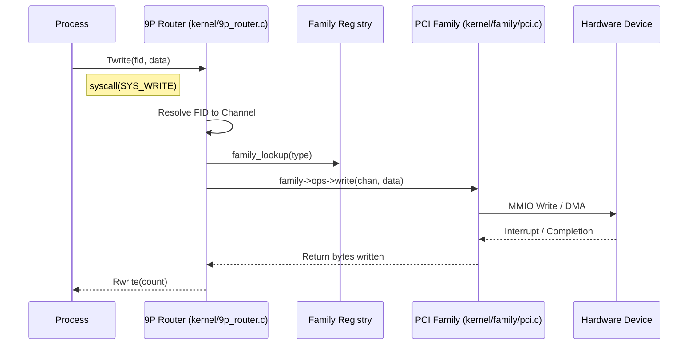

# Lux9 System Diagrams

## 1. Pebble Memory Management Lifecycle



## 2. 9P Router & Family HAL Flow



## 3. Security Architecture (Kinetic Defense & TPM)

```mermaid
graph TD
    subgraph "Kinetic Defense (pow_gate.c)"
        Req[Resource Request] --> Calc{Calculate Difficulty}
        Calc -->|Load + Magnitude| Diff[Target Zeros]
        Req --> Hash[SipHash(Seed + Nonce + Context)]
        Hash --> Verify{Leading Zeros >= Target?}
        Verify -->|Yes| Permit[Allow Operation]
        Verify -->|No| Deny[Block Operation]
    end

    subgraph "Hardware Root of Trust"
        TPM[TPM 2.0 Hardware]
        Driver[TPM Driver (tpm2_driver.c)]
        SAPI[Minimal SAPI (tpm2_sapi_minimal.c)]
        
        TPM <--> Driver
        Driver <--> SAPI
    end

    subgraph "Cryptographic Services"
        SAPI --> Random[Hardware RNG]
        SAPI --> Seal[Data Sealing (PCRs)]
        Permit --> Pebble[Pebble Memory Alloc]
        Pebble --> BlindLedger[Blind Ledger Capabilities]
        BlindLedger --> Mono[Monocypher (Crypto Primitives)]
    end
```
